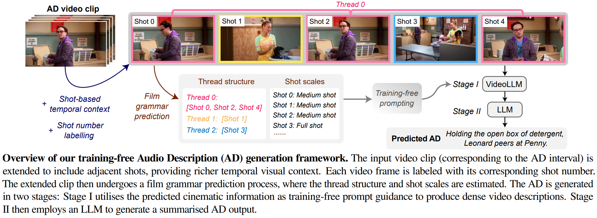

# Shot🎞️-by-Shot🎞️: Film-Grammar-Aware Training-Free Audio Description Generation

Junyu Xie<sup>1</sup>, Tengda Han<sup>1</sup>, Max Bain<sup>1</sup>, Arsha Nagrani<sup>1</sup>, Eshika Khandelwal<sup>2</sup> <sup>3</sup>, Gül Varol<sup>1</sup> <sup>3</sup>, Weidi Xie<sup>1</sup> <sup>4</sup>, Andrew Zisserman<sup>1</sup>

<sup>1</sup> Visual Geometry Group, Department of Engineering Science, University of Oxford <br>
<sup>2</sup> CVIT, IIIT Hyderabad <br>
<sup>3</sup> LIGM, École des Ponts, Univ Gustave Eiffel, CNRS <br>
<sup>4</sup> CMIC, Shanghai Jiao Tong University

<a src="https://img.shields.io/badge/cs.CV-2504.01020-b31b1b?logo=arxiv&logoColor=red" href="https://arxiv.org/abs/2504.01020">  
</a>
<a href="https://www.robots.ox.ac.uk/~vgg/research/shot-by-shot/" alt="Project page"> 
</a>
<br>
<br>
<p align="center">
  
</p>


## Datasets and Results
In this work, we evaluate our model on common AD benchmarks including [CMD-AD](https://www.robots.ox.ac.uk/~vgg/research/autoad/), [MAD-Eval](https://github.com/Soldelli/MAD), and [TV-AD](https://www.robots.ox.ac.uk/~vgg/research/autoad-zero/#tvad).
#### Video Frames
* **CMD-AD** can be downloaded [here](https://github.com/TengdaHan/AutoAD/tree/main/autoad_iii). 
* **MAD-Eval** can be downloaded [here](https://github.com/Soldelli/MAD).
* **TV-AD** can be downloaded following instructions [here](https://github.com/Jyxarthur/AutoAD-Zero).
#### Ground Truth AD Annotations
* All annotations can be found in `resources/annotations/`.

#### Predicted ADs
* The AD predictions (by Qwen2-VL+LLaMA3 or GPT-4o+GPT-4o) can be downloaded [here](https://drive.google.com/drive/folders/1glNKnEamZG372TR03Nnw4MTErpzjW-6g?usp=sharing).


## Action Score
We propose a new evaluation metric, named "action score", that focuses on whether a specific ground truth (GT) action is captured within the prediction. 
<!--It is <br> -->
<!--<b>(i)</b> character-free, meaning that the presence of character names has minimal impact <br>-->
<!--<b>(ii)</b> recall-oriented, without penalising additional action information in the prediction-->

The detailed evaluation code can be found in `action_score/`.


## Audio Description (AD) Generation

#### Requirements
* **Basic Dependencies:** ```python>=3.8```, ```pytorch=2.1.2```, ```transformers=4.46.0```, ```Pillow```, ```pandas```, ```decord```, ```opencv```

* For inference based on open-sourced models, set up path for cache (for Qwen2-VL, LLaMA3, etc.) by modifying `os.environ['TRANSFORMERS_CACHE'] = "/path/to/cache/"` in `stage1/main_qwen2vl.py` and `stage2/main_llama3.py`

* For inference based on proprietary GPT-4o models, set up path for API keys by modifying `os.environ["OPENAI_API_KEY"] = <open-api-key>` in `stage1/main_gpt4o.py` and `stage2/main_gpt4o.py`


#### Preprocessing
To structure the context frames according to shots, as well as recognise characters in each shot, please refer to guideline in `preprocess/`. <br>
<span style="color:gray"><i>(This step can be skipped by directly referred to the pre-computed results in the form </i> `resources/annotations/{dataset}_anno_context-3.0-8.0_face-0.2-0.4.csv`<i>)</i></span>

#### Film Grammar Prediction
To predict the film grammar including shot scales and thread structures, please follow the steps detailed in `film_grammar/`. <br>
<span style="color:gray"><i>(This step can be skipped by directly referred to the pre-computed results in the form </i> `resources/annotations/{dataset}_anno_context-3.0-8.0_face-0.2-0.4_scale_thread.csv`<i>)</i></span>

#### Inference
###### - Generating Dense Description by VLM (Stage I)
```
python stage1/main_qwen2vl.py \  # or stage1/main_gpt4o.py to run with GPT-4o
--dataset={dataset} \            # e.g., "cmdad"
--anno_path={anno_path}          # e.g., "resources/annotations/cmdad_anno_context-3.0-8.0_face-0.2-0.4_scale_thread.csv" \
--charbank_path={charbank_path}  # e.g., "resources/charbanks/cmdad_charbank.json" \
--video_dir={video_dir} \
--save_dir="{save_dir} \
--font_path="resources/fonts/times.ttf" \
--shot_label 
```
`--dataset`: choices are `cmdad`, `madeval`, and `tvad`. <br>
`--anno_path`: path to AD annotations *(with character recognition results and film grammar predictions)*, available in `resources/annotations`. <br>
`--charbank_path`: path to external character banks, available in `resources/charbanks/`. <br>
`--video_dir`: directory of video datasets, example file structures can be found in `resources/example_file_structures` (files are empty, for references only). <br>
`--save_dir`: directory to save output csv. <br>
`--font_path`: path to font file for shot labels (default is Times New Roman) <br>
`--shot_label`: add shot number label at the top-left of each frame  <br> 

###### - Generating AD Sentence by LLM (Stage II)
```
python stage2/main_llama3.py \  # or stage2/main_gpt4o.py to run with GPT-4o
--dataset={dataset} \           # e.g., "cmdad"
--mode={mode} \                 # e.g., "single"
--pred_path={pred_path} \       
--save_dir={save_dir} 
```
`--dataset`: choices are `cmdad`, `madeval`, and `tvad`. <br>
`--mode`: `single` for single AD output; `assistant` for five candidate AD outputs <br>
`--pred_path`: path to the stage1 saved csv file. <br>
`--save_dir`: directory to save output csv. <br>


## Citation
If you find this repository helpful, please consider citing our work! &#128522;
```
@article{xie2025shotbyshot,
	title={Shot-by-Shot: Film-Grammar-Aware Training-Free Audio Description Generation},
	author={Junyu Xie and Tengda Han and Max Bain and Arsha Nagrani and Eshika Khandelwal and G\"ul Varol and Weidi Xie and Andrew Zisserman},
	journal={arXiv preprint arXiv:2504.01020},
	year={2025}
}
```

## References
Qwen2-VL: [https://huggingface.co/Qwen/Qwen2-VL-7B-Instruct](https://huggingface.co/Qwen/Qwen2-VL-7B-Instruct) <br>
LLaMA3: [https://huggingface.co/meta-llama/Meta-Llama-3-8B-Instruct](https://huggingface.co/meta-llama/Meta-Llama-3-8B-Instruct) <br>
GPT-4o: [https://openai.com/api/](https://openai.com/api/) <br>


 
