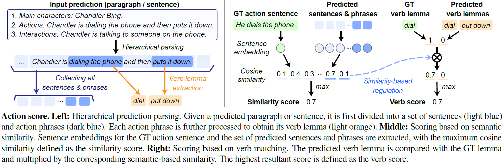

## Action Score

<p align="center">
  
</p> 
We propose a new evaluation metric, named "action score", that focuses on whether a specific ground truth (GT) action is captured within the prediction. 
It is <br> 
<b>(i)</b> character-free, meaning that the presence of character names has minimal impact <br>
<b>(ii)</b> recall-oriented, without penalising additional action information in the prediction


#### Requirements
(It is recommended to construct a separate environment from that used for AD generation.) <br>
**Basic Dependencies**: `python>=3.8`, `pytorch=2.1.0`, `transformers=4.44.2`, `flash_attn=2.5.6`, `spacy=3.8.2`, `pandas`

#### Preprocessing
The GT actions are extracted from GT ADs by two steps: (i) replacing the character names with corresponding pronouns; (ii) splitting the sentence into subsentences, each containing one action.

These preprocessing steps have been already conducted for CMD-AD, TV-AD and MAD-Eval, with the GT actions available in `gt_actions/`. <span style="color:gray"><i>(Therefore can directly jump to the next step if the evaluation is conducted on these three datasets)</i></span>


#### Action Score Computation
```
python get_action_score.py
--dataset={dataset} \                    # e.g., "cmdad"
--mode={mode} \                          # e.g., "ad"
--pred_path={pred_path}               
--save_path={save_path}
```
`--dataset`: choices are `cmdad`, `madeval`, and `tvad`. <br>
`--mode`: <b>"ad"</b> (default) corresponds to evaluating single AD sentences (Stage II outputs), no sentence division is applied; 
<b>"paragraph"</b> corresponds to evaluating description paragraph (Stage I outputs), an additional division will be applied to first partition the paragraph into sentences. <br>
`--pred_path`: path to the prediction.<br>
`--save_path`: (Optional) path to save detailed scores. <br>

## References
SpaCy: [https://spacy.io/models/en](https://spacy.io/models/en) <br>
gte-Qwen2-7B-instruct: [https://huggingface.co/Alibaba-NLP/gte-Qwen2-7B-instruct](https://huggingface.co/Alibaba-NLP/gte-Qwen2-7B-instruct) <br>

 
