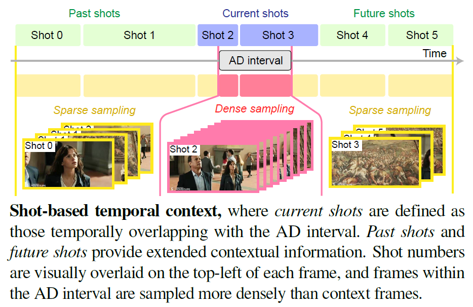

## Preprocessing

<p align="center">
  
</p>

#### Shot Segmentation
The first step is to partition the whole video clip into different shots
```
python shot_detection.py \ 
--dataset={dataset} \       # e.g., "cmdad"
--anno_path={anno_path}     # e.g., "resources/annotations/cmdad_anno.csv" \
--video_dir={video_dir} \
--save_path={save_path}
```
`--dataset`: choices are `cmdad`, `madeval`, and `tvad`. <br>
`--anno_path`: path to raw AD annotations, in the form `resources/annotations/{dataset}_anno.csv`. <br>
`--video_dir`: directory of video datasets, example file structures can be found in `resources/example_file_structures` (files are empty, for references only). <br>
`--save_path`: path to save output csv. <br>

<span style="color:gray"><i>(This step can be skipped by directly referred to the pre-computed results in the form </i> `resources/annotations/{dataset}_shot_info.csv`<i>)</i></span>


#### Shot-Based Context Structuring
Based on the shot information, we find the "current shots" that correspond to the AD interval, then extend to include two "past shots" and two "future shots".
```
python context_extension.py \  
--dataset={dataset} \       # e.g., "cmdad"
--anno_path={anno_path}     # e.g., "resources/annotations/cmdad_anno.csv" \
--shot_path={shot_path}     # e.g., "resources/annotations/cmdad_shot_info.csv" \
--save_path={save_path}
```
`--dataset`: choices are `cmdad`, `madeval`, and `tvad`. <br>
`--anno_path`: path to raw AD annotations, in the form `resources/annotations/{dataset}_anno.csv`. <br>
`--shot_path`: path to shot segment information, in the form `resources/annotations/{dataset}_shot_info.csv`. <br>
`--save_dir`: directory to save output csv. <br>


#### Character Recognition
For each extracted shot (current shots or context shots), uniformly sample 32 frames and annotate characters by face recognition. The example face recognition code can be found [here](https://github.com/Jyxarthur/AutoAD-Zero/treemain/char_recog).

<span style="color:gray"><i>(The two above steps can be skipped by directly referred to the pre-computed results in the form </i> `resources/annotations/{dataset}__anno_context-3.0-8.0_face-0.2-0.4.csv`<i>)</i></span>


## References
PySceneDetect: [https://www.scenedetect.com/](https://www.scenedetect.com/) <br>

